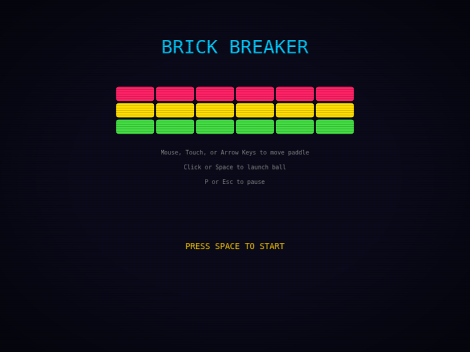

# Brick Breaker

A retro arcade brick-breaker game built with **Phaser 3** (CANVAS renderer). Zero external assets — all textures generated programmatically at runtime.



## Features

- **5 levels** with unique brick patterns (solid, checker, fortress, diamond, pyramid)
- **Combo system** — consecutive brick hits multiply your score
- **3 power-ups** — wide paddle, multi-ball, extra life
- **3 sound packs** — classic, retro, synth (Web Audio API oscillators)
- **4 visual skins** — default, fire, ice, rainbow (paddle + ball)
- **High score** persistence via localStorage
- **Leaderboard** via built-in REST API
- **CRT visual effects** — scanlines and vignette (CSS-only)

## Getting Started

```bash
npm install
npm run dev
```

Open http://localhost:3000. Click or press Space to start.

## Controls

| Input | Action |
|-------|--------|
| Mouse / Arrow Keys / A,D | Move paddle |
| Space / Click | Launch ball / Start game |
| P / Esc | Pause |
| Tab | Settings menu |
| M | Toggle mute |

## Build

```bash
npm run build       # Production build → dist/
npm run preview     # Preview production build
npm test            # Run Playwright tests
```

## Tech Stack

- **Phaser 3** — CANVAS renderer, manual AABB physics
- **Vite** — dev server (port 3000), bundler
- **Playwright** — 83 E2E tests (Chromium)
- **Web Audio API** — oscillator-based sound, no external files

## Architecture

5 scenes: `Boot → Menu → Game → GameOver/Win`. Core gameplay lives in `GameScene.js` with sub-stepped ball movement, manual physics (no Phaser physics engine), and persistent Graphics rendering.
